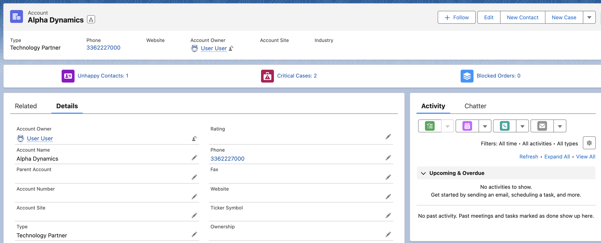

# Related-Records-Highlights

 

[Install unlocked Package (Production)](https://login.salesforce.com/packaging/installPackage.apexp?p0=04t7Q000000IM2VQAW)
 
[Install unlocked Package (Sandbox)](https://test.salesforce.com/packaging/installPackage.apexp?p0=04t7Q000000IM2VQAW)

# Overview 

The Related Records Highlights compoenent is a small component that highligts a group of related records on a record page. The component allows you to quickly bring attention to related records that are of special interest to your user. 

The component support being placed on any record, standard or custom, and is easily configured and set up with the use of custom metadata records. 

An Highlight item can be expanded to show the records. The first column is a link to the record.

## Configuration

The component is configured with the help of custom metedata records, and can be configured for any record.

<b>Fields</b>
* <b>SObjectName</b> - The api name of the object
* <b>Items Query</b> - The SOQL query that should be used to fetch the related records. The parent record id is passed to the query as ":recordId".  
Example: <i>[SELECT Id,Subject FROM Case WHERE AccountId =:recordId]</i>
* <b>Component Id</b> - Indicates for which component that has been placed on records pages this highlight item setting should be used for. The component Id is added bith to the metadata record, and the component when placed in a record page. The setting can be reused in several different pages by separating the componentIds with a ','.
* <b>Sort Order</b> - Indicates the order that the items should have when rendered in the component. Goes from 0-9
* <b>Item name</b> - The name of the item that will show in the component.
* <b>Table Columns</b> - Columns that should be shown when the highlight items are expanded. Should be the field API names and separated by ','. The API names will be used to fetch the field labels.
* <b>Icon</b> - Uses the SLDS icon names to select the icon that should be used for the item. Example: 'standard:contact'
* <b>Show Empty Items</b> - If checked, the highlight item will render even if the query didn't return any records.